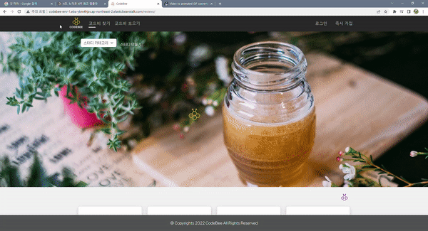
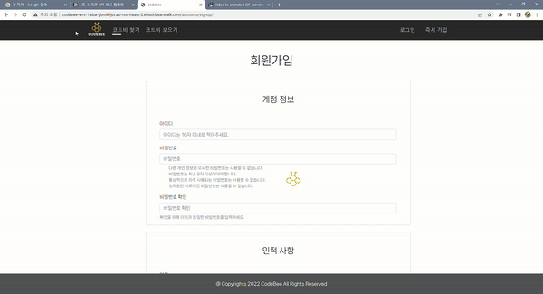
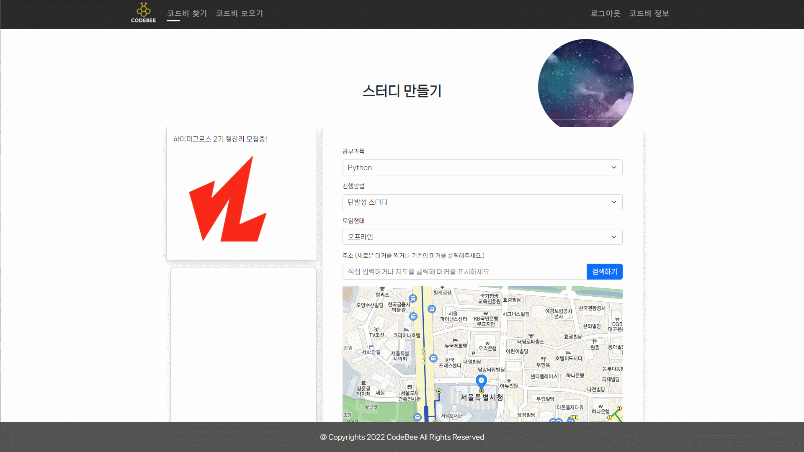
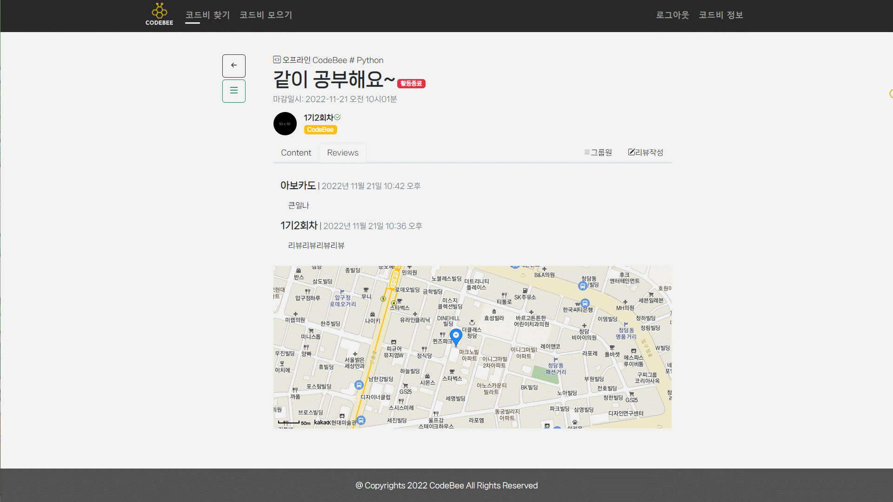
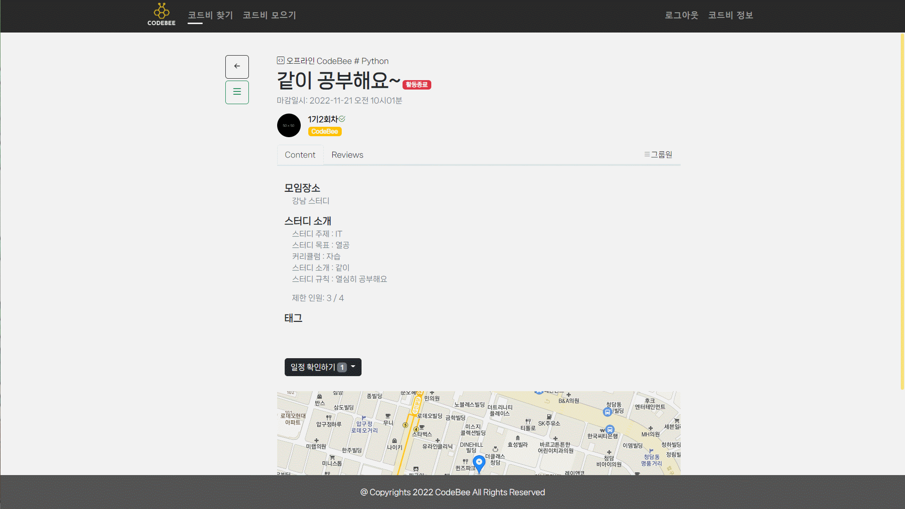
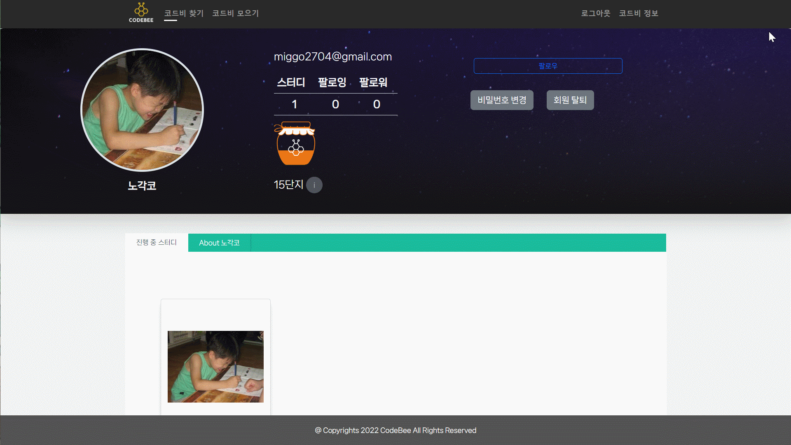
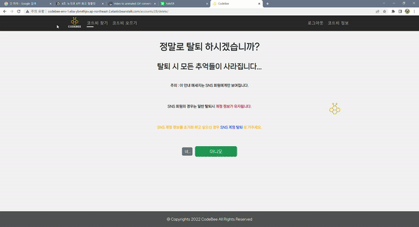
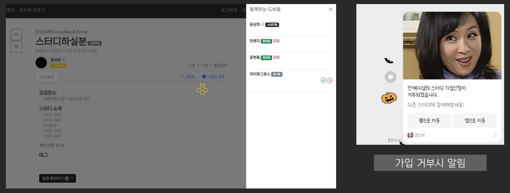
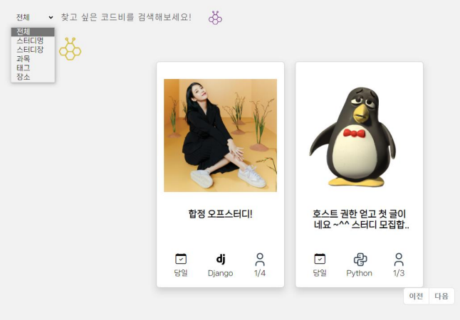

# ✏Team 노각코

## ✅ 프로젝트 소개

-16691708076806.png)

- 프로젝트 개요: 노각코 팀의 스터디 및 다양한 모임 플랫폼
- 프로젝트 명 : CodeBee ( 코드비 )
- 벌집으로 날아드는 벌처럼 모여서 공부하고 꿈을 이루자
- 프로젝트 기간:  2022.11.09 ~ 2022.11.22
- http://codebee-env-1.eba-ybm4hjsv.ap-northeast-2.elasticbeanstalk.com/reviews/

 

## 🎯 기획 목표

- 스터디 모임 플랫폼

- 온라인, 오프라인 분류

- 각 스터디 주제, 태그별 카테고리

- 다양한 활동을 위한 모임 플랫폼

 

## 🎯 프로젝트 목표

### Frontend

- Django-Template 사용을 통한 템플릿 관리
- **내장 라이브러리 사용 경험** 쌓기
- REST API 활용 능력 향상
- **AWS** 사용을 통한 **동적 사이트** 배포

 

### Backend

- Django 사용을 통한 DB 관리
- AWS 사용을 통한 사이트 배포
- Social Login 기능 구현
- 카카오 메시지 기능 추가

 

### 📣공통

- 백엔드-프론트엔드 커뮤니케이션 및 통신으로 **협업 경험 쌓기**

 

## 👥 팀원 구성

- **Frontend**

  - 안예지
  - 윤효근

  **Backend**

  - 김현중(팀장)
  - 문현동
  - 문상희
  
     

## 🎥 시연 영상

Main

- Login ( 일반가입, 소셜가입 구분 - 구글, 깃헙, 카카오)

- Signup ( postcode, 인증을위한 휴대폰, 이메일 )

- index ( 카테고리별 분류, 카드디자인 )
  
- study_detail
  - Select option - 직접입력, select
  - 온라인의 경우 온라인주소
  - 오프라인의 경우 지도에 마커 표시 혹은 주소입력으로 좌표저장
  - 태그 기능 구현 ( 자동완성기능, DB에서 사용자가 사용한 태그들을 불러옴 )

- 스터디 참여신청 > 호스트의 승인 > 활동 종료 > 리뷰 작성 활성화 > 작성 > 수정, 삭제 (비동기)

- Accounts_detail ( follow, 활동내역 )

- 회원탈퇴 ( 소셜탈퇴, 탈퇴 )

 

## 👨‍💻 적용 기술

- Frontend: JavaScript, CSS, Bootstrap, Kakao Map api, Social Login API

- Backend: Python, Django,

- 협업 tool: Git & Github, Notion, Discord, Kanbanboard

       
       
       
       
       
       
       
     

 

## 🖊 주 구현 기능

- 회원인증
  - 인증된 회원만 스터디 모집 게시글 작성이 가능
  - 실참여자만 작성 가능한 후기 시스템으로 정보의 정확도를 향상

- 모각코 진행 장소 정보 제공 기능

  - 원하는 지역 주변 정보를 제공

    ex) 강남 스터디,

  - 키워드 검색

- 카카오 메시지 알림 기능

  - 카카오 메시지 알림 기능으로 스터디 활동 편의성 제공
  - 직접 작성 간으한 기능으로 원활한 스터디 진행에 도움

- 유저간 정보 제공

  - Github 등 회원 정보 제공으로 유저간 상호 작용을 활성화

- 스터디 승인 · 거부 · 강퇴 기능

  - 유저 기반의 스터디 자정 작용

  

- 카테고리의 세분화

  - 유저가 필요로 하는 스터디 탐색 기능

  

-  

## 💻 팀원별 상세 구현 기능

**김현중**

- Home 작성
  - Home 페이지 대문 구현
  - 스터디 만들기, 참여하기 버튼
  - 스터디 만들기, 참여하기 시 주의사항 안내
  
- Index 온,오프라인 분류
  - 그리드 적용
- Study 만들기
  - 그리드 적용
  - 광고배너, 지도 검색 결과 리스트, 지도 분리
  - Select input, 직접입력 선택시 input 구현
  - 온라인, 오프라인 선택시 타입에 맞는 입력창 제공
    - Label, Placeholder, map display
    - JS 작성
  - Kakao Map api 구현
    - 초기 지도에서 주소 혹은 키워드 검색 기능 구현
    - 검색시 관련 리스트 출력
    - 지도에 마커를 선택하거나 새로운 마커를 찍을 경우 해당 좌표, 도로명 주소 반환
    - 반환된 주소를 자동입력, 마커의 상호명 입력, 위도, 경도 DB에 전송
    - Text Area initial 적용, (스터디 소개 양식 제공)
    - 스터디 시작일 종료일, Study의 외래키로 관리, ( 여러번 스터디 모임 가능 )
    - 해시태그 기능 구현, (Tagify)
      - 자동완성, 기본값 + DB에 있는 이전 사용자들이 사용한 Tag 제공

- Study Detail
  - 모집중인 스터디와 모집이 마감된 스터디 템플릿 분리
  - Detail Front 구현 
    - 스터디 소개 줄바꿈 구현
    - 리뷰 작성탭과 모달로 작성폼 제공
    - DB에 저장된 X,Y (위도,경도)값으로 지도를 띄워줌
  - 카카오 메시지전송 기능 구현
    - 카카오톡 인증 유저 한정
    - 스터디에 가입신청을 했을 경우 스터디장에게 알림메시지 전송
    - 스터디장은 카카오톡 인증된 유저들에게 메시지를 담아 보낼 수 있음
    - 기타 알림등은 추가 예정
- Study Review
  - 리뷰 작성 모달폼 구현
  - 리뷰 수정 및 삭제 비동기 구현
  - 리뷰의 경우 참여자는 한 개의 종료된 스터디에 한 개의 후기만을 작성할 수 있음
  - Front : 버튼숨김, 리뷰는 볼 수 있음
  - Back: 스터디에 참여했고, 한 번만 작성 가능함.

 

**안예지**

- 인덱스 페이지(`/reveiws/`)
  - 게시글 카드 디자인
    - 언어 타입 별로 다른 이모지 출력
    - 현재 가입 신청 인원/제한 인원 출력
    - 카드 title 잘리지 않게 ellipse 처리
- 유저 정보 페이지(`/accounts/<int:pk>`)
  - 헤더 이미지
  - 유저가 참여 중인 현재 진행 중 스터디 출력
  - 유저의 활동 내역 출력
    - github, BOJ
    - 스터디 참여 내역 출력, 스터디 언어별 다른 음영 주기
    - 최근 리뷰 활동 카드 디자인
  - 단지 시스템 구현
    - 점수에 따라 단지 이미지 채워지게

 

**문현동**

- Base.html
  - 네비게이션 디자인  
    - 호버시 다양한 색으로 반응  
  - 스크롤 바 디자인
    - simplebar 적용 

- Accounts app  
  - 회원가입
    - 아이디 입력 폼 재정의
    - 이메일, 휴대폰 번호, 닉네임, 프로필 사진 추가 가능
    - 주소 입력 가능
      - 다음 주소검색 기능
  - 소셜 로그인/로그아웃
    - sns 계정 정보로 회원가입 입력 폼에 담을 정보 자동입력
    - 유저 토큰으로 버튼 클릭시 자동 로그인 가능
      - 카카오
      - 깃헙
      - 구글
    - 연동 해지 가능
  - 회원정보 수정
    - 이메일 인증
      - 구글 smtp 로 인증 메일 발송
      - 인증 링크 클릭시 메일 인증
    - 휴대폰 인증
      - 네이버 클라우드 api 로 인증번호 생성 후 전송
      - 인증 번호 입력시 인증

**윤효근**

<Reviews> 

- 댓글 비동기 CRUD 
- Index 프론트 

<Accounts> 

-Login 프론트  

<AWS BeansTalk> 배포

**문상희**

- study 관련 CRUD 기능 생성
  - reviews app에 Study를 생성, 수정, 삭제하는 기능 구현
  - 생성은 소셜 가입을 한 유저나 휴대전화, 이메일 인증을 거친 유저만 가능하게 설정
  - 수정, 삭제는 글쓴 본인만 수정 혹은 삭제가 가능하도록 설정
- 스터디 가입 신청 모델, 기능 생성
  - 스터디 필드에 신청한 유저 필드와 허가 상태 표현하는 필드로 구성
  - 스터디 필드와 신청한 유저 필드는 ForeignKey 사용
  - Study에 대한 가입을 신청하고 허가 받은 유저만 활동할 수 있도록 설정
  - 스터디 가입 신청 기능 생성
  - 스터디 가입 승락 기능 생성
    - 호스트(스터디장)의 고유 권한으로 부여
  - 스터디 참여 거부 기능 생성
    - 스터디 탈퇴, 강퇴 기능과 공유
    - 스터디 강퇴, 거부는 호스트의 고유 권한
    - 스터디장을 제외한 모든 스터디원 강퇴 가능
    - 탈퇴 기능은 본인만 가능하게 설정
- 유저간 평가 모델, 기능 생성 
  - 스터디 참여한 유저들간 상호 평가 기능을 구현
  - 스터디, 평가받는 유저, 받가한 유저를 ForeignKey로 가지는 모델을 생성
  - 기존의 팔로우 기능처럼 좋아요나 싫어요 평가한 유저 다시 같은 평가 시 평가 취소되도록 구현
- 검색 기능 추가
  - 검색 결과에 따라 걸러진 스터디 정보를 보여주는 기능 추가
  - field를 탭을 주어 검색 영역을 선택할 수 있도록 해주었음.
- 팔로우 기능 구현
  - 유저간 상호 팔로우 기능을 부여
  - 유저 상세정보 페이지에 위치시킴.
